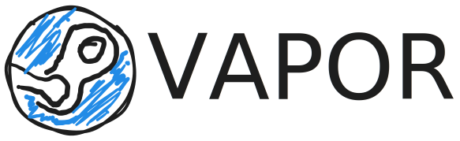

<h1 class="title"> Introdução ao  Desenvolvimento Web com Flask </h1>

<h3 class="sub"> Ana Barbosa, Wenderson Nascimento </h3>

<!-- _footer:  -->

---

# Prática do minicurso

- Construir uma aplicação simples de **catálogo de jogos**;

- Criar interfaces e um pequeno sistema.



---

# HTML

*Hypertext Markup Language* é a linguagem utilizada para exibição das páginas web.

O HTML é construído por texto e marcadores (*tags*).

Os navegadores interpretam o código do HTML e exibem os resultados.

---

## Exemplo Básico

```html
<!DOCTYPE html>
<html>
<head>
  <meta charset="UTF-8">
  <title>Primeiro Site</title>
</head>

<body>
  <h1>Hello, World</h1>
  <p>Texto muito legal</p>
</body>
</html>
```

Acessando o arquivo pelo navegador, é possivel visualizar a página.

---
# CSS

*Cascade Style Sheets* é a linguagem de estilo para páginas web.

CSS determina como os elementos do HTML são renderizados.

O código pode ser incorporado no HTML, ou exportado de um arquivo externo.

---

## Exemplo. CSS Incorporado

CSS pode ser escrito diretamente no HTML.

```html
<head>
  <style>
    body{
      background-color: grey;
      font-size: 32px;
    }
  </style>
</head>
```

Isso pode gerar arquivos com muitas linhas, assim criando um código grande demais.

---

## Exemplo. CSS Exportado

Fazemos um `link` no HTML com o CSS.

```html
<head>
    <link rel="stylesheet" href="main.css">
</head>
```

Escrevemos o código em um arquivo dedicado.

`main.css`
```css
body{
  background-color: blue;
  font-size: 32px;
}
```

---

# Python

Python é uma liguagem de programação que permite intregação rápida de sistemas.

Possui uma sintáxe simples e fácil de aprender.

`main.py`
```python
nome = input("Digite aqui: ")
print("Hello", nome)
```

---

# Flask

É um *framework* leve para desenvolvimento web.

Ótimo para aplicações simples e rápidos.

Menos robusto em comparação com outros *frameworks* Python, como o **Django**.

> Saiba mais com a [Documentação](https://palletsprojects.com/projects/flask/)

---

## Instalação

Antes de instalar o Flask, é necessário criar um ambiente virtual.

- Criar ambiente virtual
```shell
python -m venv venv
```
- Ativar ambiente virtual
```shell
venv\Scripts\Activate.ps1
```
- Instalar o Flask
```shell
pip install flask
```

---

## Primeira Aplicação

`app.py`
```python
from flask import Flask

app = Flask(__name__)

@app.route("/")
def index():
    return "Hello, world!"
```

Execute o app com `flask run`, e acesse em [localhost:5000](http://localhost:5000)

---

## Templates

São modelos que facilitam a criação da interface.
Flask usa a ferramenta de templates [Jinja](https://palletsprojects.com/projects/jinja).
No projeto, os arquivos ficam na pasta `templates/`.

`templates/index.html`
```html
<!DOCTYPE html>
<html>
<head>
    <meta charset="UTF-8">
    <title>Vapor</title>
</head>
<body>
    <h1>Vapor - Catálogo de Jogos</h1>
</body>
</html>
```

---

Para fazer o Flask renderizar templates, precisamos importar a função `render_template`.

Indicamos qual template será renderizado pelo nome do arquivo.

`app.py`
```python
from flask import Flask, render_template

app = Flask(__name__)

@app.route("/")
def index():
    return render_template("index.html")
```

> O HTML deve estar na pasta `templates/`

---

### Herança de Templates

É possível criar um modelo base de HTML e reutilizá-lo.

`templates/base.html`
```html
<!DOCTYPE html>
<html>
<head>
    <meta charset="UTF-8">
    <title>Vapor - </title>
</head>
<body>
    

    
</body>
</html>
```

---

`templates/index.html`
```html


 Início 


  <header>
      <h1>Vapor - Catálogo de Jogos</h1>
  </header>



  <main>
    <section>
      <h2>Jogos Recentes</h2>
    </section>
  </main>

```

---

### Variáveis

Com Flask, podemos enviar valores de variáveis para os templates.

`app.py`
```python
from flask import Flask, render_template

app = Flask(__name__)

@app.route("/")
def index():
    jogo = {"nome": "Stardew Valley", "ano": 2016}
    return render_template("index.html", variavel=jogo)
```

---

`index.html`
```html

  <main>
    <section>
      <h2>Jogos Recentes</h2>
      <p>{{variavel.nome}} - {{variavel.ano}}</p>
    </section>
  </main>

```

Dessa forma, enviamos dados do backend para o frontend da nossa aplicação.

---

### Laços de Repetição

Criar conteúdos que se repetem extensivamente também é mais fácil.

Vamos criar uma simulação de banco de dados.


`database.py`
```python
# Simulação de Banco de Dados
jogos = [
    {"nome": "Stardew Valley", "ano": 2016},
    {"nome": "Terraria", "ano": 2015},
    {"nome": "Undertale", "ano": 2011},
]
```

---

Uma nova função e um novo template.

`app.py`
```python
from database import jogos

@app.route("/jogos/")
def listar_jogos():
    return render_template("listar_jogos.html", jogos=jogos)
```

Com uma **lista** podemos criar um laço de repetição no template.

---

`listar_jogos.html`
```html


 Lista Jogos 


  <header>
    <h1>Lista de Jogos</h1>
  </header>



  <main>
    <section>
      <h2>Jogos</h2>
      <ul>
        
          <li>{{ jogo.nome }} - {{ jogo.ano }}</li>
        
      </ul>
    </section>
  </main>

```

---

### Condicionais

Podemos criar condições para definir o que será exibido no template.

`app.py`
```python
@app.route("/")
def index():
    return render_template("index.html", jogos=jogos)
```

> Adicionando `jogos` no index.

---

`index.html`
```html

  <main>
    <section>
      <h2>Jogos Recentes</h2>
      <ul>

        
          
            <li>
              <b>{{ jogo.nome }}</b> - {{ jogo.ano }}
            </li>
          
        

      </ul>
    </section>
  </main>

```

---

### Formulários

Envio de dados entre frontend e backend é uma das interações mais comuns.
Podem ser feitas com formulários.

`cadastrar_jogo.html`
```html



  <main>
    <section>
      <h2>Formulário de Cadastro</h2>
      <form action="{{ url_for('cadastrar_jogo') }}" method="POST">
        <input type="text" name="nome" placeholder="Nome">
        <input type="number" name="ano" placeholder="Ano de Lançamento">
        <input type="submit" value="Enviar">
      </form>
    </section>
  </main>

```

---

Após o envio do forms no HTML, tratamos os dados e redirecinamos o usuário para a listagem.

Usamos as funções `url_for` e `redirect`.

`app.py`
```python
from flask import Flask, render_template, request, url_for, redirect

@app.route("/jogos/criar/", methods=["GET", "POST"])
def cadastrar_jogo():
    if request.method == "POST":
        nome = request.form["nome"]
        ano = request.form["ano"]
        jogos.append({"nome": nome, "ano": int(ano)})
        return redirect(url_for("listar_jogos"))
    else:
        return render_template("cadastrar_jogo.html")
```

---

### Arquivos Estáticos

Para implementar CSS e outros arquivos no Flask, adicionamos eles ao diretório `static/`.

`static/css/main.css`
```css
body {
  max-width: 650px;
  margin: 40px auto;
  padding: 0 10px;
  font-size: 18px;
  line-height: 1.6;
  font-family: "Noto Sans";
  color: #333;
}
h1, h2, h3 {
  line-height: 1.2;
}
```

---

Usamos `url_for` no template, defimos `static` e o nome do arquivo para linkar.

`base.html`
```html
<head>
  . . .

  <link rel="stylesheet"
   href="{{ url_for('static', filename='css/main.css') }}"
  >
</head>
```

> Note que é usado **aspas duplas** fora e **aspas simples** por dentro.

---

# Incrementando o Projeto

## Navegação

Juntando a tag de âncora `<a>` e o `url_for`.

`base.html`
```html
  <nav>
    <ul>
      <li><a href="{{ url_for('index') }}">Inicio</a></li>
      <li><a href="{{ url_for('cadastrar_jogo') }}">Cadastrar Jogo</a></li>
      <li><a href="{{ url_for('listar_jogos') }}">Lista de Jogos</a></li>
    </ul>
  </nav>
```

---

## Filtro de Busca

Criamos um `forms` com método GET para enviar argumentos à url.

`listar_jogos.html`
```html
  <h2>Jogos</h2>
  <form action="{{ url_for('listar_jogos') }}" method="GET">
    <label for="filtro-ano">Ano de Lançamento</label><br>
    <input type="text" name="filtro-ano">
    <input type="submit" value="Filtrar">
  </form>
```
> Perceba o `/?filtro-ano=` na url local.

---

Acessamos os argumentos `args` da url e fazemos uma lista filtrada com base nisso.

`app.py`
```python
@app.route("/jogos/")
def listar_jogos():
    filtro_ano = request.args.get("filtro-ano")
    if filtro_ano:
        jogos_filtrados = []
        for jogo in jogos:
            if jogo["ano"] == int(filtro_ano):
                jogos_filtrados += [jogo]
        return render_template("listar_jogos.html", jogos=jogos_filtrados)
    return render_template("listar_jogos.html", jogos=jogos)

```

---

## Formulários

Estilizando os formulários.

`cadastra_jogos.html`
```html
  <form action="{{ url_for('cadastrar_jogo') }}" method="POST">
    <label for="nome">Nome do Jogo</label><br>
    <input type="text" name="nome"><br>

    <label for="ano">Ano de Lançamento</label><br>
    <input type="number" name="ano"><br>

    <input type="submit" value="Enviar">
  </form>
```

---

`main.css`
```css
input{
  border: #aaa solid 2px;
  border-radius: 10px;
  padding: 5px;
  margin: 5px;
  font-size: 16px;
}
```

---

# Como aprender Desenvolvimento Web?

- Buscar informações nas documentações
- Construir projetos pessoais
- Cursos voltados para Desenvolvimento de Sistemas

---

# Referências

Flask Documentation (3.1.x) https://flask.palletsprojects.com/en/stable/

Jinja Documentation (3.1.x) https://jinja.palletsprojects.com/en/stable/

MDN Web Docs | Aprendendo Desenvolvimento Web https://developer.mozilla.org/pt-BR/docs/Learn_web_development

---

<h1 class="title"> OBRIGADO PELA ATENÇÃO! </h1>
